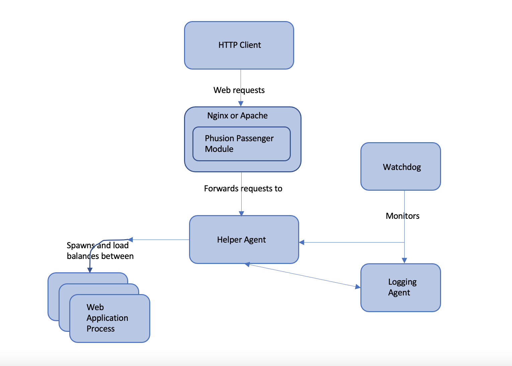

# Phusion Passenger Design and Architecture

## Intro

### Web application models and the role of the application server

Here is how a typical web applications work from the viewpoint of someone who wants to connect a web application to a web server.

A typical, isolated, web application accepts an HTTP request from some I/O channel, processes it internally, and outputs an HTTP response, which is sent back to the client. This is done in a loop, until the application is commanded to exit. This does not necessarily mean that the web app speaks HTTP directly; it just means that the web app accepts some kind of representation of an HTTP request.

```
                        3. HTTP response
                            (output)
                               ^
                               |
                               |
1. HTTP request ------> Web application 
    (input)              2. Processing
```

Some web apps are directly accessible through the HTTP protocol, while others are not. It depends on the language and framework that the web app is built on. It depends on the language and framework that the web application is built on. For example, Ruby (Rack/Rails) and Python (WSGI) web applications are typically not directly accessible through the HTTP protocol. The reasons for this are historical.

#### Common models

Here are some common models that are in use:

1. The web app is contained in an **application server**. This application server may or  may not be able to contain multiple web applications. The administrator then connects the application server to a web server through some kind of protocol. This protocol may be HTTP, FastCGI, SCGI, AJP, etc. The web server dispatches (forwards) requests to the application server, which in turn dispatches requests to the correct web application, in a format that the web application understands.
   Conversely, HTTP responses outputted by the web application are sent to the application server, which in turn sends them to the web server, and eventually to the HTTP client.
Typical examples of such a model:
    - A J2EE application, contained in the Tomcat application server, reverse proxied behind the Apache web server. Tomcat can contain multiple web applications in a single Tomcat instance.

    - Most Ruby application servers besides _Phusion Passenger_ - _Thin_, _Unicorn_, _Goliath_, etc. These application servers can only contain a single Ruby web application per instance. They load the web application into their own process and are put behind a web server (_Apache_, _Nginx_) in a reverse proxy setup.

    - _Green Unicorn_, the Python WSGI application server, behind a reverse proxy setup.

    - _PHP_ web application spawned by the _FastCGI Process Manager_, behind _Nginx_ reverse proxy setup.

2. The web app is contained directly in a **web server**. In this case, the web server acts like an **application server**. Typical examples include:

    - _PHP_ web apps running on Apache through _mod_php_. 
    - Python WSGI web applications running on Apache through _mod_uwsgi_ or _mod_python_.

    Note that this does not necessarily mean that the web application is run inside the same process as the web server: it just means that the web server manages applications. In case of _mod_php_, PHP runs directly inside the Apache worker processes, but in case of _mod_uwsgi_ the Python processes can be configurred to run out-of-process.

    _Phusion Passenger for Apache_ and _Phusion Passenger for Nginx_ implement this model, and run applications outside the web server process. 

3. The web application *is* a web server, and can accept HTTP requests directly. Examples of this model:

    - Almost all _Node.js_ and _Meteor JS_ web applications.
    - The _Trac_ bug tracking software, running in its standalone server.

    In most setups, the admin puts those in a reverse proxy configuration, behind a real web server such as _Apache_ or _Nginx_, instead of letting hem acept HTTP requests directly. 

    _Phusion Passenger Sandalone_ implements this model. However, you can expose _Phusion Passenger Standalone_ directly to the Internet because it uses _Nginx_ internally.

4. The web application does not speak HTTP directly, but it is connected directly to the web server through some communication adapter. _CGI_, _FastCGI_ and _SCGI_ are good examples of this.


The above models cover how nearly all web apps work, whether they are based on _PHP_, _Django_, _J2EE_, _ASP.NET_, _Ruby on Rails_, etc. Note that all of these models provide the same functionality i.e. no model can do something that a different model can't_ and _SCGI_ are good examples of this.


The above models cover how nearly all web apps work, whether they are based on _PHP_, _Django_, _J2EE_, _ASP.NET_, _Ruby on Rails_, etc. Note that all of these models provide the same functionality i.e. no model can do something that a different model can't. All of those models are identical to the one described in the first diagram, if the combination of web servers, app serves, web applications are considered to be a single entity - a black box.

It should also be noted that these models do not enforce any particular I/O processing implementation. The web servers, app serves, web apps could process IO serially (i.e. one request at a time), could multiplex IO with a single thread (using `select(2)` or `poll(2)`) or it could process IO with multiple threads and/or multiple processes. It depends on the implementation.

Of course, there are many variations possible. For example, load balancers could be used.


#### The rationale behind reverse proxying

Administrators often put the web application or its application werver behnind a real web server in a reverse proxy setup, even when the web app/app server already speaks HTTP. This is because implementing HTTP in a proper, secure way involves more than just speaking the protocol. The public Internet is a hostile environment where clients can send any arbitrary data and can exhibit any arbitrary IO patterns. If you don't properly implement IO handling, then you could open
yourself either to parser vulnerabilities or DoS attacks.

Web servers like Apache and Nginx have already implemented world-class IO and connection handling code and it would be waste not to use it. In the end, putting the application in a reverse proxying setup often makes the whole system more robust and more secure. This is the reason why it is considered a good practice.

A typical problem involves dealing with **slow clients**. These clients may send HTTP requests slowly and read HTTP responses slowly, perhaps taking many seconds to complete their work. A naive single-threaded HTTP server implementation that reads an HTTP requests, processes and sends the HTTP response in a loop may end up spending so much time waiting for IO that spends very little time doing actual work. Worse: suppose that the client is malicious, just leaves the socket open and never reads the HTTP response, then the server will spend forever waiting for the client, not being able to handle any more requests.

##### An example of naive HTTP server implementation
```
while true
   client = accept_next_client()
   request = read_http_request(client)
   response = process_request(request)
   send_http_response(client, response)
end
```
There are many ways to solve this problem. One could use one thread per client, one could implement IO timeouts, one could use an evented IO architecture, one could have a dedicated IO thread or process buffer requests and responses. The point is that implementing all this properly is non-trivial. Instead of reimplementing these over and over in each application server, it's better to let a real web server deal with all the details and let the application server and the web application do what they're best at: their own core business logic.


## Phusion Passenger architecture overview




Phusion Passenger is not a single, monolithic entity. Instead, it consists of multiple components and processes that work together. Part of the reason why Phusion Passenger is split like this, is because it's technically necessary (no other way to implement it). But another part of the reason is stability and robustness. Individual components can crash and can be restarted independently from each other. If we were to put everything inside a single process, hen a crash will take down all
of Phusion Passenger.

Thus, if the Passenger core crashes, or if an application process crashes, they can both be restarted without affecting he web server's stability.

### Web server module

When an HTTP client sends a request, it is receieved by the web server (Nginx or Apache). Both Apache and Nginx can be extended with **modules**. Phusion Passenger provides such a module. The module is loaded into Nginx/Apache. It checks whether the request should be handled by a Phusion Passenger-served web application, and if so, forwards the request to the Passenger core. The internal wire protocol used during this forwarding is a modified version of SCGI.

The NGINX module and the Apache module have an entirely different code base. Their code bases are in `ext/nginx` and `ext/apache2`, respectively. Both modules are relatively small because they outsource most of the logic to passenger core and because they utilize common library (`ext/common`). This design allows to support both Nginx and Apache without having to write the same things twice.

### Passenger core

The **Passenger core** is where the most of the processing is done. The core keeps track of which application processes currently exist, and using load balancing rules, determines which process a request should be forwarded to. The core also takes care of **application spawning**: if it determines that having more application processes is necessary or beneficial, then it will make that happen. Process spawning is subject to user-configured limits: the core will never spawn more processes than a user-configured maximum.

The core also has monitoring and statistics gathering capabilities

# Appendix: Simple Common Gateway Interface

The **Simple Common Gateway Interface (SCGI)** is a protocol for applications to interface with HTTP servers, as an alternative to the CGI protocol. It is similar to FastCGI but it is designed to be easier to parse. Unlike CGI, it permits a long-running service process to continue serving requests, thus avoiding delays in the responding to requests due to setup overhead (such as connecting to a database).

SCGI is a _protocol_ which defines _communication_ between a web server and an application server. This is in contrast to CGI, which is an earlier application (gateway) interface designed to let the application programmer avoid the complexity of sockets and long running service processes when poor scalability and high overhead are acceptable.

The SCGI protocol leverages the fact that the web server has already parsed and validated the HTTP request, and canonically communicates the request to the SCGI server while letting the application programmer avoid parsing ambiguities and protocol edge cases. This avoids the complicated header parsing and header combinging rules from RFC 2616 saving significant complexity in the SCGI server process. 

## Specification

The client connects to a SCGI server over a reliable stream protocol allowing transmission of 8 bit bytes. The client begins by sending a request. When the SCGI server sees the end of the request it sends back a response and closes the connection. The format of the response is not specifically specified by this protocol, although CGI-equivalent HTTP responses are generally used.


### Request format

A SCGI request is the concatenation of netstring-encoded headers and a body. A SCGI response is a normal HTTP response.
Each header consists of a name-value pair, where botht he name and the value are null-terminated strings (C strings). The value can be an empty string, in which case the terminating null still remains. Neither name nor value can contain any embedded null bytes. These considerations are standard for C strings, but are often confusing for programmers used to other standards for string-handling.

All provided headers are concatenated to form a single byte sequence, then netstring-encoded. The raw body, if any, is then appended.

Duplicate names are not allowed in the request headers; RFC 2616 compliant header combining must already have taken place. The first request header must have the name "CONTENT_LENGTH" and a value that is the length of the body in decimal. The "CONTENT_LENGTH" request header must always be present, even if its value is "0". There must also always be a request header with the name "SCGI" and a value of "1". Standard CGI environment variables should be provided in SCGI headers for compatibility when converting older CGI programs to SCGI. The body (if any) provided in the request follows the headers; its length is specified by the "CONTENT_LENGTH" request header.

While the SCGI protocol insulates the service programmer from some HTTP considerations, various details such as interpreting the octets of the message body as per the Transfer-Encoding header, the CONTENT_LENGTH being the number of octets after the body has been encoded for transmission still require knowledge of the HTTP protocol specification.

### Example

The web server (a SCGI client) opens a connection and sends the concatenation of the following strings to the service process (a SCGI server):

```
"70:"
    "CONTENT_LENGTH" <00> "27" <00>
    "SCGI" <00> "1" <00>
    "REQUEST_METHOD" <00> "POST" <00>
    "REQUEST_URI" <00> "/deepthought" <00>
","
"What is the answer to life?"
```

The SCGI server sends the following response back to the web server

```
"Status: 200 OK" <0d 0a>
"Content-Type: text/plain" <0d 0a>
"" <0d 0a>
"42"
```

The SCGI server closes the connection.
